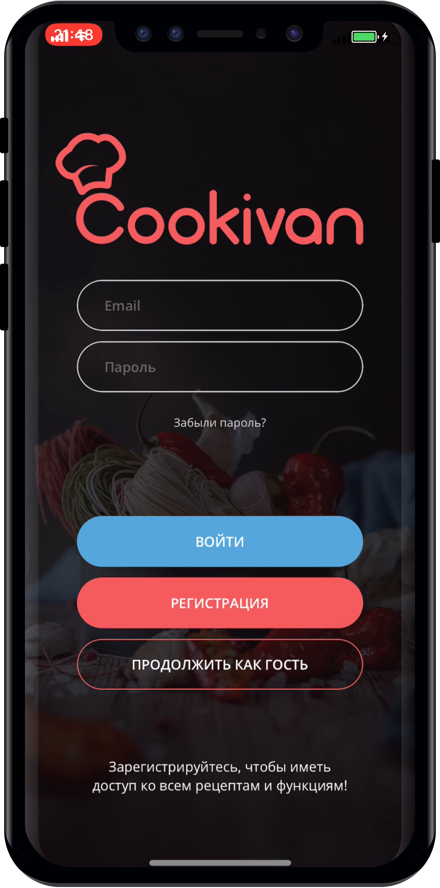

# Cookivan iOS Application
This application is created as a mobile version of [Cookivan](https://cookivan.com)

Design by [IvanFriz](https://www.behance.net/friziivan51c5)

 

### Current features of V1.0:
1. User registration and authorization with input data validation [Firebase](https://firebase.google.com).
2. Ability to log in as a quest without required registration.
3. Main screen with the list of recipes.

List of CocoaPods dependencies used in the project:
1. [Firebase](https://firebase.google.com) libraries for authorization and as a DataBase: 
  1. Firebase/Core'
  2. 'Firebase/Auth'
  3. 'Firebase/Firestore'
  4. 'Firebase/Storage'
2. [IQKeyboardManagerSwift](https://cocoapods.org/pods/IQKeyboardManagerSwift) for keyboard behavior handling

## Usage
1. Download the repository
`$ git clone https://github.com/angelinaFri/Cookivan`
2. Open the project in Xcode
`$ open CatFacts.xcworkspace`
3. Compile and run the application

## Requirements
* Xcode 10.1
* iOS 12.0
  
